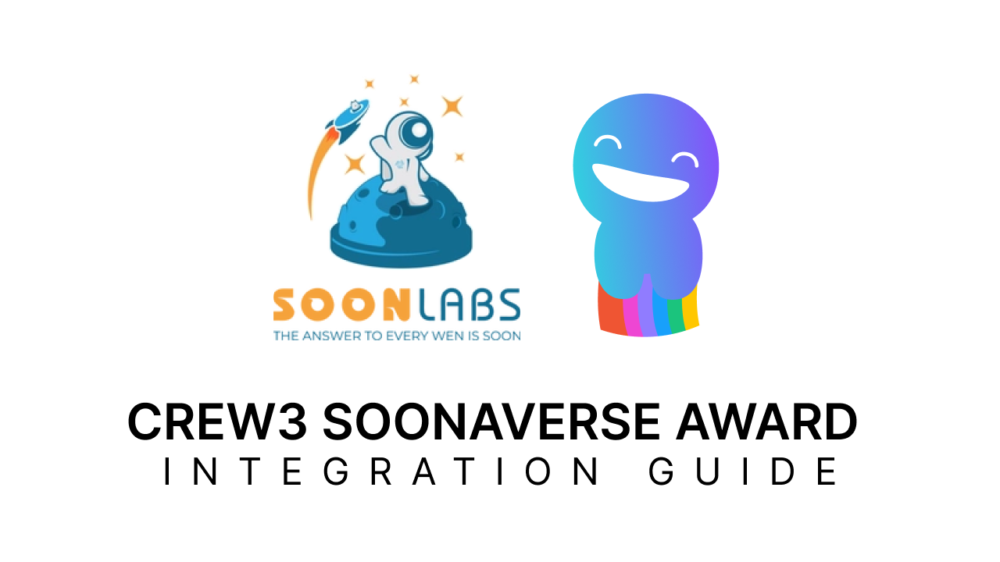
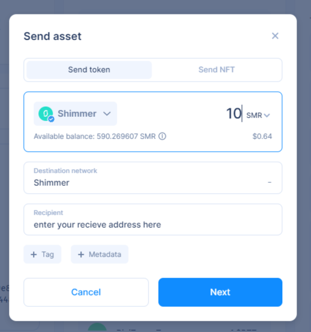
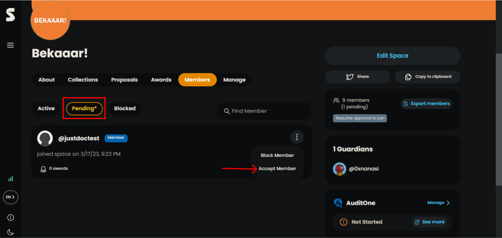
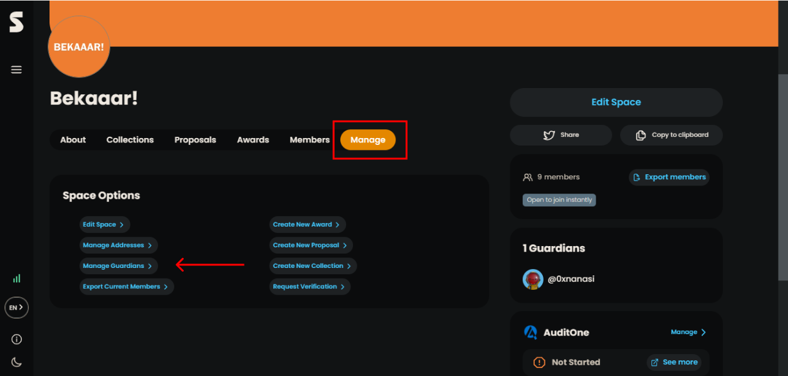
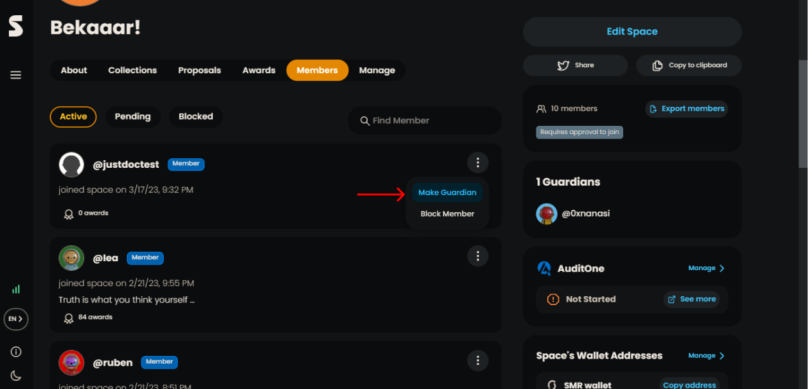
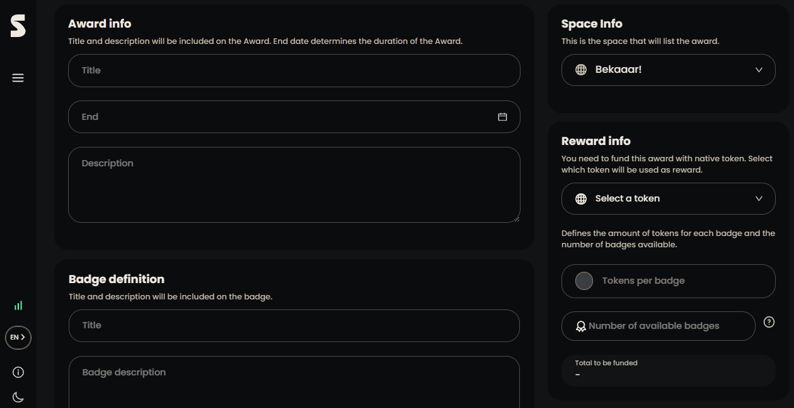

# Crew3 Soonaverse Award Integration Guide



## Overview

Below is an example on how to set-up crew3 integration with Soonaverse awards.

    1. Create a new mnemonic for your API
    2. Make the API guardian on the space
    3. Create award within the Soonaverse that's linked to quest in crew3
    4. Use script to query crew3 and issue new badge's when quest completed

## 1. Create a new mnemonic for your API

- run [src/examples/randomMnemonicSeed.ts](./../randomMnemonicSeed.ts)

  ```typescript
  import { generateMnemonic } from 'bip39';

  // 24 words
  console.log(generateMnemonic() + ' ' + generateMnemonic());
  ```

  ```bash
  ts-node src/examples/randomMnemonicSeed.ts
  ```

- set the mnemonic within the [config.json](./../../config.json)

  ```json
  {
    "mnemonic": "insert your twenty four generated words here"
  }
  ```

- run [src/examples/getMyReceiveAddress.ts](./../getMyReceiveAddress.ts) (to see your receive address)

  ```typescript
  import config from '../config.json';
  import { getNewWallet } from '../utils/wallet/Wallet';

  export const getReceiveAddress = async () => {
    const wallet = await getNewWallet();
    const sender = await wallet.getIotaAddressDetails(config.mnemonic);
    console.log('Your address: ' + sender.bech32);
  };

  getReceiveAddress(); //You will get your receive address
  ```

  ```bash
  ts-node src/examples/getMyReceiveAddress.ts
  ```

- fund your address with SMR which is necessary to make transfers on SMR. You'll always need some SMR to send requests. THOSE SMRs will be refunded back to you.
  

## 2. Make the API guardian on the space

- run [src/examples/space/join/exec-join.ts](./../space/join/exec-join.ts) space-id" to request join the space as new member.

  #### For Example:

      if you go to: https://soonaverse.com/space/0x2240f87418a6ddacfde86e30c3c40b95bb7049f6/overview

      "0x2240f87418a6ddacfde86e30c3c40b95bb7049f6" is space id.

  ```bash
  ts-node src/examples/space/join/exec-join.ts 0x2240f87418a6ddacfde86e30c3c40b95bb7049f6
  ```

- go into the space as the other guardian and accept the member. Make the member guardian (this gives the member ability to issue badges).

  
  
  

## 3. Create award within the Soonaverse that's linked to quest in crew3

- as existing guardian of the space, create an award and fund it. Make sure to set enough available badges you might need for quests in crew3.
  
  

- edit [src/examples/crew3toAward/integration-config.json](./../crew3toAward/integration-config.json) and set following fields

  ```json
  {
    "crew3Api": "insert crew3 Api here",
    "crew3CommunityName": "insert crew3 Community Name",
    "awardUid": "insert your award Uid here",
    "questUid": "insert your quest Uid here"
  }
  ```

## 4. Use script to query crew3 and issue new badge's when quest completed

- run [src/examples/crew3toAward/exec-run.ts](./../crew3toAward/exec-run.ts) to listen to quest and run the sync

  ```bash
  ts-node src/examples/crew3toAward/exec-run.ts
  ```
